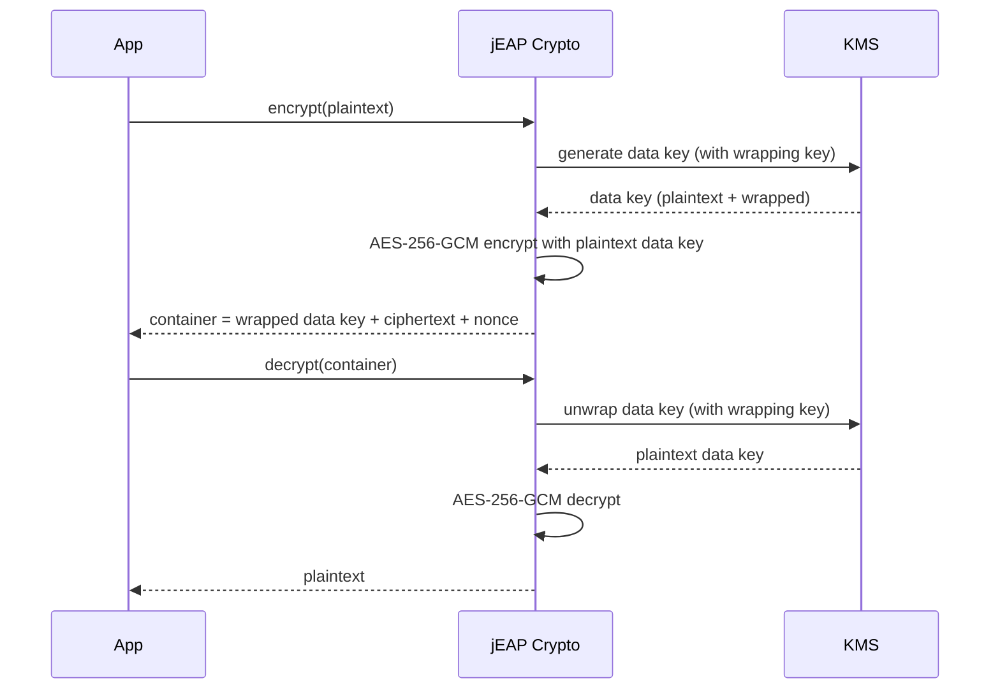

# Architecture

jEAP Crypto provides **client-side** encryption for data at-rest. The application encrypts and
decrypts data itself; a Key Management Service (KMS) is used only to generate and unwrap short-lived
data keys. This is independent of the persistence technology, in contrast to server-side encryption.

## Core principles

- Symmetric encryption of data with **AES-256-GCM**.
- Encryption/decryption happen in the library (client-side).
- Short-lived **data keys** are used for the data; the **wrapping key** never leaves the KMS.
- A defined binary **container format** stores the encrypted data together with the wrapped data key
  and the required metadata.

## Encryption / decryption flow

On encryption the library requests a data key from the KMS, which returns it both in plaintext (used
in memory to encrypt the data) and wrapped with the wrapping key. **Only the wrapped form is
persisted.** On decryption the wrapped data key from the container is sent to the KMS, which returns
the plaintext data key used to decrypt the data.

## Key concepts

| Term            | Meaning                                                                                          |
|-----------------|--------------------------------------------------------------------------------------------------|
| Data key        | Short-lived AES-256 key that encrypts the actual data. Generated by the KMS, may be cached.      |
| Wrapping key    | Long-lived key in the KMS that encrypts (wraps) data keys. Never leaves the KMS.                 |
| Crypto container| Self-describing binary format holding the wrapped data key, the ciphertext and metadata.        |
| Escrow key      | Optional extra (asymmetric) key that wraps the data key client-side for KMS-independent recovery. |

## Module overview

The public API lives in `jeap-crypto-core` (package `ch.admin.bit.jeap.crypto.api`). A KMS backend
(`jeap-crypto-vault` or `jeap-crypto-aws-kms`) implements the internal `KeyManagementService`.
`jeap-crypto-spring` adds the Spring Boot auto-configuration and registers a `CryptoService` bean per
configured wrapping key; the `jeap-crypto-vault-starter` / `jeap-crypto-aws-kms-starter` modules pull
everything together. `jeap-crypto-db` and `jeap-crypto-s3` are thin helpers on top of the APIs.

## Related

- [Getting started](getting-started.md)
- [Crypto APIs](crypto-api.md)
- [Key management](key-management.md)
- [Binary container format](data-format.md)
- [jeap-crypto](../README.md)
